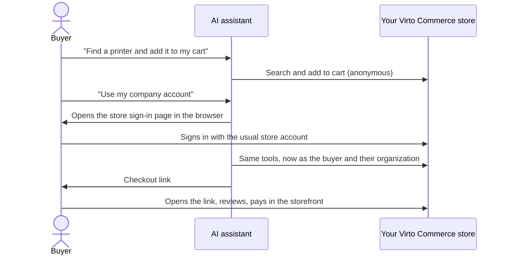
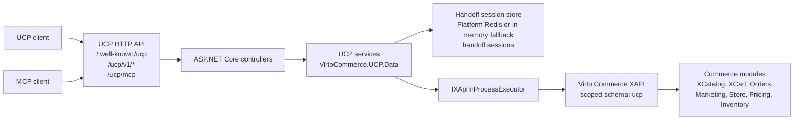

# Virto Commerce UCP Module (Preview)

The Virto Commerce UCP module exposes HTTP APIs for Universal Commerce Protocol (UCP) on top of existing Virto Commerce Platform capabilities.

It provides public UCP endpoints for discovery, catalog, cart, checkout handoff, geography, and order tracking operations. Requests are adapted to in-process Virto Commerce XAPI calls and platform services without an additional HTTP hop inside the platform process.
It also exposes a Streamable HTTP MCP endpoint at `/ucp/mcp`.

## Overview

`VirtoCommerce.UCP` is a protocol adapter module. It does not replace the Catalog, Cart, Orders, XAPI, Store, or Marketing modules. It provides a compact UCP-oriented HTTP surface for external clients while delegating commerce behavior to existing Virto Commerce modules.

Canonical public UCP endpoints are published without the `/api` prefix.

## How signed-in buyers shop through an AI assistant

This section is for merchants and business users. It describes what a buyer experiences when an AI assistant, such as Claude or ChatGPT, shops your store through UCP. Setup steps for IT are in [Enable signed-in buyers in Virto Cloud](#enable-signed-in-buyers-in-virto-cloud).



**Anonymous by default.** A buyer can search products and build a cart without signing in. The assistant does not ask for an account until the buyer needs one.

**Signing in.** When the buyer asks the assistant to use their account, order for their company, or see their orders, the assistant asks them to sign in. Your store's own sign-in page opens in the browser. The buyer signs in with their usual store account, and the assistant continues from where it stopped. The assistant never sees the buyer's password.

**What signing in unlocks.** After signing in, the assistant works with the buyer's own data:

- the buyer's prices, including organization contract pricing;
- the products available to the buyer's organization;
- the buyer's saved carts and orders.

**The anonymous cart carries over.** Items the buyer added before signing in are merged into their account cart.

**Checkout stays in your storefront.** The assistant prepares the cart and gives the buyer a checkout link. The buyer opens it, reviews the order, chooses delivery and payment, and places the order in your normal storefront. Approval rules, purchase orders and invoice terms apply there exactly as they do today. When the assistant says the checkout "requires review", it means "continue in the store", not "this order needs approval".

**The checkout link is short-lived and personal.**

- It works once and expires after 15 minutes by default.
- Only the buyer it was created for can use it; another signed-in buyer is refused.
- If the link expires, ask the assistant for a new one. The cart itself is kept.

**Signing out and switching accounts.**

- Asking the assistant to log out ends its session with your store.
- Signing out of the storefront in the browser does not sign the assistant out.
- To shop as a different account, the buyer must disconnect and reconnect the store connector in the assistant.

**What the assistant cannot do.** It cannot take payment, place orders, or see another buyer's carts, orders or prices.

### Known limitations

- Logging out does not cancel checkout links issued before logout, and an issued link cannot be revoked early. It stops working after it is used or expires.
- For a signed-in buyer, creating a cart adds items to the buyer's existing default cart instead of starting a new, empty cart.
- A shipping address given to the assistant can update the matching address saved on the buyer's account.

## Key Features

* **UCP discovery profile** — `/.well-known/ucp` publishes supported capabilities, default store metadata, endpoint metadata, headers, auth shape, integration guidance, payment handlers, and structured error codes
* **Catalog search and product details** — catalog search and product detail lookup through in-process XCatalog GraphQL
* **Cart assembly** — create, buyer-scoped list, get, and full-state update through XCart GraphQL with UCP replacement semantics
* **Checkout handoff** — checkout snapshot and hosted handoff with address prefill; temporary handoff sessions stored in Redis with TTL when the Platform Redis connection is configured. Without Redis, sessions are kept in process memory, which is only suitable for a single instance.
* **Order tracking** — order status, totals, line items, and shipment tracking by order id, order number, or cart id after handoff
* **Geography lookup** — country and region resolution through the platform `ICountriesService` for checkout address normalization
* **Streamable HTTP MCP server** — `/ucp/mcp` with typed UCP commerce tools for the installed storefront/platform, built on the official C# MCP SDK
* **Unified anonymous and authenticated buyer flows** — the same `/ucp/mcp` endpoint and the same tools support anonymous shopping or buyer identity from Virto Commerce Platform OAuth claims
* **Safe cart upgrade** — `update_cart` can verify an anonymous buyer capability and delegate anonymous-to-authenticated cart merging to XCart
* **Structured UCP errors** — machine-readable error codes with correlation id support

> **Authentication:** UCP is an OAuth protected resource only. Virto Commerce Platform/OpenIddict owns login, consent, authorization-code/PKCE, token issuance, validation, users, organizations, and registered OAuth clients.

### Multiple instances and public OAuth identity

Handoff sessions are stored through the UCP `IUcpHandoffSessionStore`. When `ConnectionStrings:RedisConnectionString` is configured, UCP uses the Platform Redis connection (`IConnectionMultiplexer`) and stores each session as a Redis string under `vc:ucp:handoff:<sha256>` with a TTL of `UCP:HandoffTokenTtlMinutes`. Without Redis, UCP uses a process-local memory store. UCP does not open its own Redis connection and does not register or replace `IDistributedCache`. A host can supply its own `IUcpHandoffSessionStore`; UCP registers its store only when none is registered.

Restore is serialized per session through the XAPI `IDistributedLockService` (`VirtoCommerce.Xapi.Core.Infrastructure`), which also uses Redis when `ConnectionStrings:RedisConnectionString` is configured and an in-process lock otherwise. The store and the lock therefore always use the same backend.

To restore handoff sessions across replicas, configure the same `ConnectionStrings:RedisConnectionString` (and Redis database) on every replica. With the memory store, another process cannot restore the session, and a restart loses it.

UCP resolves its public origin through XApi `IStoreDomainResolverService`, using `UCP:DefaultStoreId` when set, otherwise the request domain and the existing `VirtoCommerce:Stores` domain mappings and `DefaultStore`. It prefers the resolved store's `SecureUrl`, then `Url`, and falls back to the request origin when neither is available. Set `UCP:PublicOrigin` to explicitly override this resolution (for example `https://store.example.com`).

Discovery, protected-resource metadata, bearer challenges and MCP audience validation use this same origin even when discovery is read through the backend host. Add `<resolved-origin>/ucp/mcp` to Platform `Authorization:Resources` and grant `rsrc:<resolved-origin>/ucp/mcp` to the registered OAuth client. The client must connect to the advertised public MCP endpoint and use the authorization server advertised there. Resource registration and OAuth client permissions remain enforced by Platform/OpenIddict.

For rollout from process-local sessions, drain existing handoffs on the old deployment before switching traffic, or wait at least `HandoffTokenTtlMinutes` after stopping issuance. A Redis-backed release cannot recover sessions stored only in an old process. Do not mix releases using raw-token cache keys with releases using hashed keys; use a drained cutover. Current releases keep the hashed key format and use one shared lock for each session. If a concurrent restore holds that lock, UCP returns `409` with `handoff_in_progress`; the session is not consumed and the client may retry. Do not add retry-on-400 behavior: a consumed, expired or forged token must remain rejected.

`requires_escalation` means the buyer must continue in hosted checkout, not that approval is required. The response includes `hosted_checkout_required` with `requires_buyer_review`. Merchant approval rules and PO/invoice terms are applied by the existing storefront and commerce modules; UCP does not infer them from the cart amount.

Handoff store dependency spans (`VC handoff-session-store SetHandoffSession`, `GetHandoffSession`, `RemoveHandoffSession`) include `vc.ucp.handoff.key_hash`, the SHA-256 session-key suffix, on set/get/remove. This allows cross-node correlation without recording the bearer capability. The hash is a trace dimension, never a metric label. Correlate it with `vc.dependency.outcome` and the instance identity to distinguish misses, expiry, corruption and successful consumption.

## Quickstart: Connect Virto Start Cloud to Claude Desktop

This is the complete partner-facing setup for an existing Virto Start environment deployed in Virto Cloud. The Storefront host exposes the UCP endpoints, while Virto Cloud routes the requests to the Platform application where this module runs.

Before starting, identify the exact Virto Commerce Store ID and the public Storefront host. The examples below use `B2B-store` and `store.example.com`.

### 1. Install the module

Install the `VirtoCommerce.UCP` module in the Virto Start **Platform application**. The required module dependencies are listed in [Dependencies](#dependencies).

### 2. Update the Virto Cloud environment

In the Virto Cloud deployment repository, update the target environment in `infra/environments.yml`. Add the UCP settings under `platform.config`, then route `/ucp` and `/.well-known/ucp` from the Storefront host to `platform`:

```yaml
platform:
  config:
    UCP__DefaultStoreId: B2B-store
    UCP__DefaultCurrency: USD
    UCP__DefaultCultureName: en-US
    UCP__StorefrontOrigin: "https://store.example.com"
    UCP__UcpBaseUrl: "https://store.example.com/ucp/v1"
    UCP__HandoffUrlTemplate: "https://store.example.com/checkout?ucp_session={token}"
    UCP__HandoffTokenTtlMinutes: 15

routes:
  - host: store.example.com
    root: B2B-store
    paths:
      - path: /ucp
        route: platform
      - path: /.well-known/ucp
        route: platform
```

Replace `B2B-store` with the exact Store ID and `store.example.com` with the Virto Start Storefront host. Do not use the store display name as `UCP__DefaultStoreId`.

The `/ucp` route covers `/ucp/mcp` and all `/ucp/v1/*` endpoints. `/.well-known/ucp` needs its own route because it is outside the `/ucp` prefix.

Deploy the updated Virto Cloud environment. This restarts the Platform with the UCP configuration and applies the public routes.

### 3. Verify the Virto Start endpoint

Open the Storefront discovery URL in a browser:

```text
https://store.example.com/.well-known/ucp
```

Before connecting Claude, verify that the response contains:

- the expected `default_store_id`;
- the expected store currency, language, and storefront URL;
- `mcp_tools` with tools such as `get_store_capabilities` and `search_products`;
- `endpoints.ucp_base_url` equal to `https://store.example.com/ucp/v1`.

The remote MCP URL is:

```text
https://store.example.com/ucp/mcp
```

The Storefront host must be publicly reachable from Anthropic's cloud. A host restricted to a VPN or private network cannot be used as a Claude remote connector unless the network allows Anthropic's published IP ranges.

### 4. Add the connector to Claude Desktop

Remote MCP servers are configured as Claude custom connectors. Do **not** put this remote URL in `claude_desktop_config.json`; that file is for locally launched MCP servers.

For an individual Claude plan:

1. Open Claude Desktop and go to **Customize > Connectors**.
2. Select **+ > Add custom connector**.
3. Set the name to `Virto Commerce UCP`.
4. Set the remote MCP server URL to `https://store.example.com/ucp/mcp`.
5. Select **Add**.
6. In a new conversation, select **+ > Connectors** and enable `Virto Commerce UCP`.

For a Team or Enterprise plan, an Owner must first add the URL under **Organization settings > Connectors**. Each user can then connect to and enable it for a conversation.

See Anthropic's [remote MCP custom connector guide](https://support.claude.com/en/articles/11175166-get-started-with-custom-connectors-using-remote-mcp) for the current Claude UI and network requirements.

### 5. Run the first Claude smoke test

Start a new Claude conversation with the connector enabled and send:

```text
Use the Virto Commerce UCP connector. First call get_store_capabilities.
Then search for products matching "printer". Use the default store, currency,
and language published by the server. Ask me to select a store only if the
server publishes multiple stores and no default_store_id.
```

Claude should call `get_store_capabilities` and then `search_products` without asking for values already published by the server.

### Troubleshooting

| Symptom | Check |
| --- | --- |
| Claude cannot connect | Confirm that the Cloud Environment routes `/ucp` to `platform`, the Storefront host is public, and the updated environment was deployed. |
| `missing_store_id` | Confirm that `platform.config.UCP__DefaultStoreId` contains the exact Store ID and the updated environment was deployed. |
| Search returns no products | Confirm that the store is open, the catalog is assigned to the store, prices and inventory exist, and the search index has been built. |
| Checkout opens the wrong host | Configure `Store.SecureUrl` / `Store.Url`, or set `UCP__StorefrontOrigin` and `UCP__HandoffUrlTemplate`. |
| A Team or Enterprise user cannot add the connector | Ask an organization Owner to add the custom connector first. |

## Enable signed-in buyers in Virto Cloud

The [quickstart](#quickstart-connect-virto-start-cloud-to-claude-desktop) above sets up anonymous shopping. The steps below let buyers sign in, so the assistant can shop with their prices, organization, carts and orders. The examples use `B2B-store` as the Store ID and `https://store.example.com` as the public Storefront host.

UCP does not sign buyers in itself. Virto Commerce Platform (OpenIddict) handles sign-in, consent and tokens; the Storefront hosts the sign-in page. The Storefront host therefore acts as both the MCP endpoint and the OAuth authorization server.

### 1. Check the prerequisites

| Component | Requirement |
| --- | --- |
| Platform | `3.1072.0` or later, for OAuth resource indicators and Storefront sign-in ([vc-platform#3108](https://github.com/VirtoCommerce/vc-platform/pull/3108)). |
| UCP module | A release that includes the authenticated buyer flow ([vc-module-ucp#7](https://github.com/VirtoCommerce/vc-module-ucp/pull/7)). |
| Storefront | A `vc-frontend` release that includes the `/oauth/authorize` sign-in page and authenticated handoff restore ([vc-frontend#2467](https://github.com/VirtoCommerce/vc-frontend/pull/2467)). |
| Redis | Required when the Platform runs more than one replica. See step 3. |

### 2. Update the Platform configuration

Add these values under `platform.config` in `infra/environments.yml`, next to the UCP values from the quickstart:

```yaml
platform:
  config:
    UCP__DefaultStoreId: B2B-store
    UCP__PublicOrigin: "https://store.example.com"
    Authorization__Resources__0: "https://store.example.com/ucp/mcp"
    Authorization__OAuthLoginPath: /oauth/authorize
```

- `UCP__PublicOrigin` is the host that UCP advertises for discovery, MCP and OAuth.
- `Authorization__Resources__0` allows Platform to issue tokens for the UCP MCP endpoint. If `Authorization:Resources` already lists other addresses, add this one with the next index instead of replacing them.
- `Authorization__OAuthLoginPath` sends buyers to the Storefront sign-in page instead of the Platform back-office sign-in page.

All of these values, the OAuth client permission in step 5, and the existing `UCP__StorefrontOrigin`, `UCP__UcpBaseUrl` and `UCP__HandoffUrlTemplate` values must use the **same host**. Mixing the Platform host and the Storefront host produces tokens that UCP rejects.

### 3. Provide Redis when the Platform has more than one replica

Checkout links and their single-use protection are shared between Platform replicas through Redis. Without Redis, each replica keeps its own links, so a link opened on another replica is reported as expired or already used. In QA with two replicas and no Redis, about half of anonymous and about three quarters of signed-in checkout links failed on the first attempt.

Platform reads Redis from `ConnectionStrings__RedisConnectionString`. In Virto Cloud this connection string is a secret, not a plain `platform.config` value. Ask Virto Cloud support to provision Redis for the environment. *To verify: the exact provisioning steps for Virto Cloud environments.*

A single-replica environment works without Redis, but open checkout links are lost when the Platform restarts.

### 4. Route the OAuth paths to the Platform

The quickstart routes `/ucp` and `/.well-known/ucp`. Signed-in buyers also need the OAuth endpoints on the Storefront host, because the Storefront sign-in page calls them on its own host and AI assistants discover them from there:

```yaml
routes:
  - host: store.example.com
    root: B2B-store
    paths:
      - path: /ucp
        route: platform
      - path: /.well-known/ucp
        route: platform
      - path: /.well-known/oauth-protected-resource
        route: platform
      - path: /.well-known/openid-configuration
        route: platform
      - path: /connect
        route: platform
```

- `/.well-known/oauth-protected-resource` tells the assistant which authorization server protects `/ucp/mcp`.
- `/.well-known/openid-configuration` publishes the authorization server metadata.
- `/connect` covers sign-in (`/connect/authorize`), tokens (`/connect/token`), sessions (`/connect/session`) and sign-out.

Keep `/oauth/authorize` routed to the Storefront; it is the sign-in page. *To verify: whether an AI client in use also requests `/.well-known/oauth-authorization-server`; if it does, route it to the Platform too.*

Deploy the updated environment.

### 5. Register an OAuth client for the AI assistant

Each AI assistant signs buyers in through a registered OAuth client:

| Field | Value |
| --- | --- |
| Client type | `public` (no client secret) |
| Consent type | `systematic` |
| Redirect URI | The callback URL of the AI assistant. For Claude custom connectors this is `https://claude.ai/api/mcp/auth_callback` (*to verify against the current Anthropic documentation*). |
| Permissions | `rsrc:https://store.example.com/ucp/mcp` |

The **Security > OAuth applications** screen has no field for `rsrc:` permissions. Create the client through the Platform API instead, for example from the browser console while signed in to the Platform Manager as an administrator:

```javascript
(async () => {
  const api = angular.element(document.body).injector().get("platformWebApp.oauthapps");
  const app = await api.new().$promise;
  app.displayName = "Claude";
  app.clientType = "public";
  app.clientSecret = null;
  app.consentType = "systematic";
  app.redirectUris = ["https://claude.ai/api/mcp/auth_callback"];
  app.permissions = ["rsrc:https://store.example.com/ucp/mcp"];
  const saved = await api.save({}, app).$promise;
  console.log("CLIENT_ID:", saved.clientId, "PERMISSIONS:", saved.permissions);
})().catch(console.error);
```

Check that the printed permissions contain `rsrc:https://store.example.com/ucp/mcp`, and give the printed `CLIENT_ID` to whoever sets up the assistant. Later edits to the client on the OAuth applications screen keep the `rsrc:` permission.

### 6. Connect the AI assistant

**Claude.** Add the custom connector as in the [quickstart](#4-add-the-connector-to-claude-desktop), with the remote MCP server URL `https://store.example.com/ucp/mcp`. Under **Advanced settings**, enter the OAuth client ID from step 5.

**ChatGPT.** Full MCP connectors require a ChatGPT Business or Enterprise/Edu workspace with developer mode enabled. Create one app under **Settings > Apps > Create** with the URL `https://store.example.com/ucp/mcp` and OAuth authentication. See the [OpenAI developer mode guide](https://help.openai.com/en/articles/12584461-developer-mode-apps-and-full-mcp-connectors-in-chatgpt-beta).

Use one connector for both anonymous and signed-in shopping. Do not add a second connector for signed-in buyers.

### 7. Verify the setup

1. Open `https://store.example.com/.well-known/ucp`, and the same path on the Platform host. Both must report the same MCP endpoint, `https://store.example.com/ucp/mcp`.
2. Open `https://store.example.com/.well-known/oauth-protected-resource/ucp/mcp`. `resource` must be `https://store.example.com/ucp/mcp`, and `authorization_servers` must be `["https://store.example.com/"]`.
3. In a new conversation, ask the assistant to use your account. It must call `link_buyer_identity`, open the Storefront sign-in page, and then report `linked: true` with your buyer and organization.
4. Ask it to add a product to your cart and prepare checkout. Open the checkout link: the Storefront must show your cart, prices and organization.

### 8. Keep checkout links out of analytics

The checkout link carries its one-time token in the `ucp_session` query parameter. Until [VCST-6053](https://virtocommerce.atlassian.net/browse/VCST-6053) is fixed, the token can be sent to Google Analytics as part of the page URL and stored in Application Insights telemetry. Remove `ucp_session` from page URLs in your analytics configuration.

### Troubleshooting signed-in buyers

| Symptom | Check |
| --- | --- |
| Token request fails with `invalid_target` | `Authorization__Resources__0` contains `https://store.example.com/ucp/mcp`, and the OAuth client has the permission `rsrc:https://store.example.com/ucp/mcp`. |
| `link_buyer_identity` returns `401 invalid_token` after sign-in | The MCP URL, `UCP__PublicOrigin`, the resource and the OAuth client permission all use the Storefront host. |
| Sign-in opens the Platform back-office page | `Authorization__OAuthLoginPath` is set to `/oauth/authorize`, and the Storefront includes the sign-in page. |
| Sign-in page cannot complete, or the assistant never receives a token | `/connect` and `/.well-known/openid-configuration` are routed to `platform` on the Storefront host. |
| Checkout links are reported as expired or already used on the first try | The Platform has more than one replica and no Redis. See step 3. |
| `403 buyer_context_mismatch` | The link was opened by a different buyer, or a client sent a legacy `X-Buyer-*` header. |
| The assistant keeps using the previous account | Signing out of the Storefront does not change the assistant's token. Disconnect and reconnect the connector. |

## Configuration

Configuration is read from the `UCP` section:

```json
{
  "UCP": {
    "DefaultStoreId": "store-acme",
    "DefaultCurrency": "USD",
    "DefaultCultureName": "en-US",
    "UcpBaseUrl": "https://store.example.com/ucp/v1",
    "StorefrontOrigin": "https://store.example.com",
    "HandoffUrlTemplate": "https://store.example.com/checkout?ucp_session={token}",
    "HandoffTokenTtlMinutes": 15,
    "AnonymousCatalog": true,
    "Observability": {
      "InputCaptureMode": "ErrorsOnly",
      "EnableApplicationInsightsCompatibilityBridge": true
    }
  }
}
```

| Key | Type | Default | Description |
| --- | --- | --- | --- |
| `UCP:DefaultStoreId` | String | — | Virto Commerce Store ID used when the client does not pass `store_id`. Use the exact Store ID, not the display name. |
| `UCP:DefaultCurrency` | String | — | Default currency code for catalog, cart, and checkout operations. |
| `UCP:DefaultCultureName` | String | — | Default culture, for example `en-US`. |
| `UCP:UcpBaseUrl` | String | — | Public base URL of the UCP API published in the discovery profile. |
| `UCP:StorefrontOrigin` | String | — | Fallback storefront origin for hosted checkout URLs in environments without Store URLs. |
| `UCP:PublicOrigin` | String | — | Overrides the public origin used by discovery and MCP OAuth. Otherwise resolved through XApi from the store's `SecureUrl` / `Url`, then the request origin. |
| `UCP:HandoffUrlTemplate` | String | — | Explicit override for the hosted checkout handoff URL. `{token}` is replaced with the `ucp_session` token. |
| `UCP:HandoffTokenTtlMinutes` | Integer | `15` | Absolute expiration of temporary checkout handoff sessions in the handoff session store. |
| `UCP:AnonymousCatalog` | Boolean | `true` | Allows anonymous catalog search and product detail requests. |
| `UCP:Observability:InputCaptureMode` | Enum | `ErrorsOnly` | Controls the bounded allowlisted operation input in logs and span attributes: `None`, `ErrorsOnly`, or `Always`. Trace correlation, safe context attributes, and counters remain enabled in every mode. |
| `UCP:Observability:EnableApplicationInsightsCompatibilityBridge` | Boolean | `true` | Exports UCP activities through the classic Virto Commerce Application Insights module. Disable it when OpenTelemetry already exports the same traces to the target Application Insights resource. |

If `DefaultStoreId` is not configured, discovery reads open stores from the Store module. If one store is found, `/.well-known/ucp` returns it as `default_store_id`, `store`, and the only `stores[]` item. If multiple stores are found, discovery returns them in `stores[]` and the client must choose a store explicitly.

Checkout handoff URLs are built from the Virto Commerce Store URL (`Store.Url` / `Store.SecureUrl`) for the selected default store. `UCP:StorefrontOrigin` is a fallback for environments without Store URLs, and `UCP:HandoffUrlTemplate` is an explicit override.

### Application Settings

The module registers the following platform settings:

| Setting | Type | Default | Description |
| --- | --- | --- | --- |
| `UCP.Enabled` | Boolean | `false` | Enables UCP module functionality. Registered in the platform settings under **UCP > General**; not yet enforced by the current preview endpoints. |

### Permissions

The module registers the following permissions in the **UCP** group:

| Permission | Description |
| --- | --- |
| `ucp:access` | Access UCP module resources |
| `ucp:create` | Create UCP data |
| `ucp:read` | View UCP data |
| `ucp:update` | Update UCP data |
| `ucp:delete` | Delete UCP data |

Public UCP protocol endpoints (`/.well-known/ucp`, `/ucp/v1/*`, `/ucp/mcp`) are anonymous protocol surfaces; these permissions are reserved for the module's administrative capabilities.

## Architecture



### Request Flow

1. A client calls a canonical UCP endpoint.
2. The controller accepts the HTTP request and delegates work to a UCP service.
3. The service normalizes UCP request context and derives any authenticated buyer identity from the validated Platform principal.
4. Catalog operations are translated to XCatalog GraphQL queries.
5. Cart operations are translated to XCart GraphQL queries and mutations.
6. `IXApiInProcessExecutor` runs GraphQL inside the current platform process.
7. The service maps XCatalog, XCart, Orders, Store, and platform dictionary data back to UCP response models.

Commerce tools do not expose an authentication mode. A request without a Platform user bearer token uses the public/anonymous flow; a request with a valid token uses the linked buyer and organization from the Platform `ClaimsPrincipal`. Anonymous carts use an opaque `ucp-anonymous-*` continuation identifier. `X-Buyer-User-Id` and `X-Buyer-Organization-Id` are rejected.

The MCP protected-resource metadata is published at `/.well-known/oauth-protected-resource/ucp/mcp`. Its authorization server identifier matches the issuer published by Platform discovery, including the trailing slash. OAuth clients must be pre-registered through the existing Platform OAuth applications API; UCP does not implement dynamic client registration or issue tokens. Register the exact public MCP URI in `Authorization:Resources` and grant each client its matching `rsrc:<URI>` permission.

When Platform is private and OAuth runs through the public storefront, set `Authorization:OAuthLoginPath` to `/oauth/authorize`. The storefront must run the authenticated handoff/OAuth continuation changes and proxy `/connect/authorize`, `/connect/session`, `/connect/token`, `/revoke/token`, the discovery/JWKS endpoints, and the UCP endpoints to Platform, preserving the public host and HTTPS scheme. Leave `OAuthLoginPath` unset when using the existing Platform login page.

When a user explicitly asks to act through their account, the MCP client calls `link_buyer_identity`. Its standard HTTP 401 bearer challenge starts Platform OAuth; after linking, the ordinary commerce tools are called unchanged. To transfer an existing anonymous cart, call `update_cart` with the saved anonymous `buyer_id`, `cart_id`, and complete desired line state. UCP verifies the anonymous owner and calls XCart `mergeCart`; it does not implement a second cart merge algorithm.

With a valid bearer token, `link_buyer_identity` returns the current buyer and organization without starting another login. Signing in or out of the storefront does not switch the MCP connection's account. To switch buyers, reconnect the MCP client with a new OAuth authorization, then call `link_buyer_identity` and verify the returned identity before continuing. Repeating the tool call with the same token does not force reauthorization.

Call `logout_buyer` when the user asks to sign out. It uses Platform to revoke the current OAuth authorization and its access and refresh tokens. Connections sharing that authorization are also signed out; other OAuth applications and storefront browser cookies are unaffected. Repeating logout does not start a login. Discard the previous buyer, organization, cart, and checkout identifiers, and do not start a new login until the user asks.

MCP checks the existing Platform token and authorization records on authenticated requests, including when global persistent token validation is disabled. The query reads the shared database without OpenIddict's local entity cache, so revocation takes effect on other replicas. No separate session store or cache provider is registered.

## Module Structure

| Project | Purpose |
| --- | --- |
| `VirtoCommerce.UCP.Core` | Protocol models, service contracts, module constants, options, and errors. |
| `VirtoCommerce.UCP.Data` | Provider-neutral UCP application services and integration logic. |
| `VirtoCommerce.UCP.ExperienceApi` | XAPI schema marker for the module. |
| `VirtoCommerce.UCP.Web` | Module entry point, controllers, filters, GraphQL executor, and DI registrations. |
| `VirtoCommerce.UCP.Tests` | Unit tests for discovery, catalog, cart, checkout handoff, geography, and order tracking behavior. |

The module does not define a UCP database model and does not run module database migrations.

## Dependencies

The module manifest declares these runtime dependencies:

| Module | Version |
| --- | --- |
| `VirtoCommerce.Xapi` | `3.1015.0` |
| `VirtoCommerce.XCatalog` | `3.1000.0` |
| `VirtoCommerce.XCart` | `3.1016.0` |
| `VirtoCommerce.Store` | `3.1004.0` |
| `VirtoCommerce.Orders` | `3.1000.0` |
| `VirtoCommerce.Marketing` | `3.1000.0` |

Target framework: `.NET 10`.

Minimum Virto Commerce Platform version: `3.1039.0`. Platform `3.1038.0` contains the Microsoft.OpenApi security upgrade, but the required `VirtoCommerce.Xapi 3.1015.0` itself requires Platform `3.1039.0`.

## Web API

### Discovery

```http
GET /.well-known/ucp
```

Returns the UCP profile: supported capabilities, default store metadata, endpoint metadata, headers, auth shape, integration guidance, payment handlers, and structured error codes.

UCP operations are advertised as HTTP endpoints in `endpoints.operations`.

### Catalog Search

```http
POST /ucp/v1/catalog/search
```

Example request:

```json
{
  "query": "iphone",
  "context": {
    "store_id": "store-acme",
    "currency": "USD",
    "language": "en-US"
  },
  "filters": {
    "price": {
      "min": 50000,
      "max": 100000
    }
  },
  "pagination": {
    "limit": 10
  }
}
```

UCP prices and price filters use minor units. For example, `$700.00` is represented as `70000`.

### Product Detail

```http
GET /ucp/v1/catalog/products/{id}?store_id=store-acme&currency=USD&culture_name=en-US
```

The product response includes id, code, name, slug, image URL, brand, product type, price, list price, availability, attributes, and variations.

If a product is not found, the endpoint returns the structured error `product_not_found`.

### Cart Assembly

```http
POST /ucp/v1/carts
GET /ucp/v1/carts?store_id=store-acme&currency=USD&culture_name=en-US&buyer_id=user-42
GET /ucp/v1/carts/{cartId}?store_id=store-acme&currency=USD&culture_name=en-US
PUT /ucp/v1/carts/{cartId}
```

`create_cart` creates a cart through XCart `addItem`, then applies coupons through `addCoupon`.

`list_carts` is a Virto extension over the XCart `carts` query. Anonymous continuation requires the server-issued `buyer_id`; authenticated mode derives the buyer and organization from the Platform token. It never returns a global cart list.

`update_cart` follows UCP replacement semantics: the request describes the desired final cart state, and the adapter computes the required XCart mutations:

- `addItem`
- `changeCartItemQuantity`
- `removeCartItem`
- `addCoupon`
- `removeCoupon`

To remove a line item, omit it from `line_items` or pass an existing `line_items[].id` with `quantity: 0`.

### Geography

```http
GET /ucp/v1/geography/countries?query=United%20States&limit=10
GET /ucp/v1/geography/countries/resolve?query=KZ
GET /ucp/v1/geography/countries/{countryId}/regions
```

Geography endpoints are thin adapters over the platform `ICountriesService`.

- `list_countries` returns platform countries and supports simple search by `id` or `name`.
- `resolve_country` accepts ISO2, ISO3, or platform country name and returns the platform country id, for example `KZ -> KAZ`.
- `list_regions` returns platform regions or provinces for a resolved country id.
- `city` is not resolved through a dictionary and remains a free-text checkout address field.

MCP clients should use these endpoints before checkout when country or region data comes from natural language input. This avoids guessing and preserves the existing storefront and XCart address contracts.

### Checkout Handoff

```http
POST /ucp/v1/checkouts
PATCH /ucp/v1/checkouts/{checkoutId}
GET /ucp/v1/checkouts/{checkoutId}/payment-handlers
POST /ucp/v1/checkouts/{checkoutId}/handoff
POST /ucp/v1/internal/handoff/restore
```

The current checkout flow is hosted-only:

- `create_checkout` creates a checkout snapshot from the cart.
- If the request contains `shipping_address` or `billing_address`, the module applies them to XCart before creating the snapshot.
- `update_checkout` updates address hints before payment and applies addresses to XCart.
- `checkout_and_handoff` creates the checkout snapshot and immediately returns the hosted checkout `continue_url`; MCP clients should prefer it when the buyer is ready to pay or continue to storefront checkout.
- `handoff_checkout` returns a `continue_url` with an opaque `ucp_session`.
- `storefront_restore` validates `ucp_session`, reads the session payload from the handoff session store, checks expiration, and returns cart and checkout context to the storefront.
- Shipping method and payment details are completed in storefront checkout.

`ucp_session` is an opaque random session token. The checkout/cart context, address snapshot, payment hint, and expiration timestamp are stored server-side in the handoff session store with absolute expiration based on `UCP:HandoffTokenTtlMinutes`. Without Redis, the store keeps sessions in process memory, so handoff works in local or single-node deployments. In production multi-node deployments, configure `ConnectionStrings:RedisConnectionString` so handoff restore works across nodes and sessions survive process restarts.

`shipping_address` and `billing_address` are applied to the cart through XCart `addOrUpdateCartAddress` and are also stored in the temporary handoff session payload. Before writing an address, UCP normalizes `country_code` through the platform `ICountriesService`. If the selected country has regions, `region` / `region_id` are normalized through `GetCountryRegionsAsync`.

If `shipping_address` or `billing_address` is passed to UCP, `first_name` and `last_name` are required. The module returns `invalid_request` when the recipient name is missing. For best hosted checkout UX, also pass `postal_code`, `email`, and `phone` when available.

`notes` are not treated as a delivery address. If the request contains an address only in `notes`, the response includes warning `shipping_address_not_notes`; the next `update_checkout` or `handoff_checkout` call should include a structured `shipping_address`.

Example handoff request:

```json
{
  "cart_id": "cart-1",
  "context": {
    "store_id": "store-acme",
    "currency": "USD",
    "language": "en-US",
    "buyer_id": "ucp-anonymous-0123456789abcdef0123456789abcdef"
  },
  "buyer": {
    "email": "buyer@example.com"
  },
  "shipping_address": {
    "first_name": "Ada",
    "last_name": "Buyer",
    "line1": "1 Main St",
    "city": "Seattle",
    "region_id": "WA",
    "region": "Washington",
    "postal_code": "98101",
    "country_code": "US",
    "country_name": "United States",
    "phone": "555-0100",
    "email": "buyer@example.com"
  },
  "billing_address": {
    "first_name": "Ada",
    "last_name": "Buyer",
    "line1": "1 Main St",
    "city": "Seattle",
    "region_id": "WA",
    "region": "Washington",
    "postal_code": "98101",
    "country_code": "US",
    "country_name": "United States",
    "phone": "555-0100",
    "email": "buyer@example.com"
  },
  "payment_handler": "hosted_checkout"
}
```

### Order Tracking

```http
GET /ucp/v1/orders/{orderId}?buyer_id=user-42&culture_name=en-US
GET /ucp/v1/orders?cart_id={cartId}&buyer_id=user-42&culture_name=en-US
```

`track_order` returns order status, order number, totals, line items, shipment snapshot, payment snapshot, and shipment tracking fields when they are available in order data.

After hosted handoff, the client usually does not know `order_id` yet. The primary path is lookup by the original `cart_id`, matched against `CustomerOrder.ShoppingCartId` through Orders module services. Lookup stays within the resolved buyer and organization context. If the buyer signed in during guest checkout, link that identity before tracking the order.

If the order has not been created yet or is not found within that buyer context, the endpoint returns the structured error `order_not_found`.

## MCP Server

```http
POST /ucp/mcp
GET /ucp/mcp
```

The MCP server uses the official C# SDK `ModelContextProtocol.AspNetCore` with Streamable HTTP transport in stateless mode.

The MCP server exposes typed UCP commerce tools for the Virto Commerce storefront/platform where this module is installed:

- `get_store_capabilities`
- `search_products`
- `get_product`
- `create_cart`
- `list_carts`
- `get_cart`
- `update_cart`
- `create_checkout`
- `update_checkout`
- `checkout_and_handoff`
- `get_payment_handlers`
- `handoff_checkout`
- `list_countries`
- `resolve_country`
- `list_regions`
- `track_order`

Commerce tools do not accept storefront URLs. The MCP endpoint itself represents the target Virto Commerce UCP installation, and tools execute the module's local UCP services directly inside the platform process.

This follows the hosted-commerce MCP pattern: install or configure the MCP remote for the storefront/platform you want the agent to operate on, then use the typed tools for search, cart, checkout, geography, handoff, and order tracking.

## Error Model

Known UCP error codes:

- `invalid_request`
- `handoff_in_progress` — another request is restoring the same `ucp_session`; retryable (`409`)
- `missing_store_id`
- `product_not_found`
- `cart_not_found`
- `order_not_found`
- `xapi_invalid_response`

Responses include correlation id when available. The module reads `X-Correlation-Id` and falls back to the ASP.NET Core trace identifier. UCP REST responses also include `X-Trace-Id` for direct correlation with distributed traces.

GraphQL error responses produced by an in-process XAPI schema are not remapped to a synthetic UCP `502` error. REST returns the original GraphQL JSON envelope with GraphQL HTTP semantics. MCP returns `isError: true`, preserves the original envelope in `structuredContent`, and returns the same JSON in model-visible text content so an AI agent can inspect XAPI codes, paths, locations, extensions, and partial data.

Every UCP MCP tool result also contains a model-visible `Trace ID: ...` text block and `_meta.trace_id`. This allows Claude, GPT, and operators to open the exact MCP → UCP → XAPI trace for both successful and failed calls.

## Observability and Logging

The module emits exporter-neutral `VirtoCommerce.UCP` activities and metrics through the standard .NET diagnostics APIs:

```text
MCP/REST request
└─ UCP <operation>
   └─ XAPI <schema> <GraphQL operation>
      └─ existing SQL, Elastic, HTTP, cache, and other dependency spans
```

Each actual in-process XAPI execution gets its own span. UCP does not create or modify an OpenTelemetry provider and does not configure an OTLP exporter, endpoint, sampler, service resource, Serilog sink, or minimum logging level; those remain controlled by Platform and the installed observability module. When the classic Virto Commerce Application Insights module is installed, UCP can additionally use a small compatibility bridge to export these activities as correlated dependencies.

Each UCP operation writes one structured terminal log: `Information` for success/rejection/cancellation and `Error` for failures. The log contains outcome, duration, XAPI call/failed/canceled/GraphQL-error counts, factual XAPI mutation attempt/failed counts, and trace/span ids. It does not infer transaction commit state or retry safety.

The terminal event has stable `EventId=2000`, `EventName=ucp.operation.completed`, and schema version `1`. When enabled by `InputCaptureMode`, its `InputJson` is an operation-specific allowlist rather than a serialized request body. It retains values needed to reproduce a call (for example search text, requested/effective store, currency, culture, product/cart/order identifiers, line item identifiers and quantities) and reports truncation explicitly. UCP response bodies and output snapshots are not copied into telemetry; successful-result semantics are verified by reproducing the captured input under a debugger when `Always` is explicitly enabled.

The following values are never copied into these snapshots: authorization or API keys, raw handoff/session tokens, address text and postal codes, buyer identities or contact data, organization identities, cart names, notes, payment data, raw coupon values, GraphQL documents, complete variables, and complete results. Tokens/cursors use a bounded fingerprint where correlation is useful; private identity, address, and buyer data use field-presence flags plus safe country/region identifiers.

Direct dependency spans record `vc.dependency.outcome`. Successful dependencies use `success`; handoff cache reads use the more specific `hit`, `miss`, `expired`, or `corrupt` outcomes without changing the client-facing invalid-session contract.

`UCP:Observability:InputCaptureMode` supports:

- `ErrorsOnly` (default): write the allowlisted input only for `error`, `rejected`, or `degraded` outcomes;
- `Always`: write it for successful and failed operations;
- `None`: omit `InputJson` and raw diagnostic query/filter values while retaining bounded operational context, derived length/hash tags, and counters.

Production Platform configuration must allow `Information` for the `VirtoCommerce.UCP` category, otherwise successful/rejected/canceled terminal events are filtered before any exporter sees them:

```json
{
  "Serilog": {
    "MinimumLevel": {
      "Override": {
        "VirtoCommerce.UCP": "Information"
      }
    }
  }
}
```

Unhandled XAPI resolver exceptions are captured through GraphQL.NET's `UnhandledExceptionDelegate`. The original exception is attached to the active XAPI span as the standard OpenTelemetry `exception` event (`exception.type`, `exception.message`, `exception.stacktrace`) and emitted as one correlated structured error log (`EventId=2001`) with the same trace/span ids and a safe failing-call input summary. Expected GraphQL errors without a CLR exception contain bounded codes, paths, and messages but no invented stack trace. UCP never writes the complete GraphQL response envelope to its own logs.

UCP deliberately does not register its sources or meter with the process-wide OpenTelemetry provider. When using Virto Commerce OpenTelemetry `3.1001.0` or later, opt them in explicitly:

```json
{
  "OpenTelemetry": {
    "Enabled": true,
    "Endpoint": "http://localhost:4317",
    "Sources": [
      "VirtoCommerce.UCP",
      "Experimental.ModelContextProtocol"
    ],
    "Meters": [
      "VirtoCommerce.UCP"
    ]
  }
}
```

Set the process-wide `OTEL_SERVICE_NAME` as usual. `Sources` and `Meters` must be arrays, and every value must match the corresponding source or meter name exactly. Without this opt-in, UCP still works, but its custom spans or metrics are not exported by that provider. In Azure Monitor, UCP/XAPI `ActivityKind.Internal` spans map to dependencies and their attributes become custom dimensions; the trace id correlates them with ASP.NET requests and structured logs.

The official Virto Commerce Application Insights module currently uses the classic Application Insights SDK, which does not export arbitrary UCP `ActivitySource` spans by itself. `EnableApplicationInsightsCompatibilityBridge=true` therefore maps UCP, XAPI, and MCP activities to classic `DependencyTelemetry` without creating a second OpenTelemetry provider. The bridge requests activity data without setting the W3C `Recorded` flag: the OpenTelemetry sampler remains authoritative for the OpenTelemetry pipeline, while the classic Application Insights telemetry processors and sampling settings apply to the bridge output. Set this option to `false` when the OpenTelemetry pipeline already exports the same traces to the target Application Insights resource, preventing duplicate dependencies.

The MCP C# SDK 1.4 copies the complete `content` of an `isError: true` result into the `tools/call` activity status description independently of logging levels. For the 16 UCP tools, an incoming MCP message filter keeps the `Error` status but replaces that description with the bounded `UCP tool returned an error.` after the response has been produced. The client still receives the lossless XAPI envelope. Foreign MCP tools and successful calls are not changed.

## Build and Test

```powershell
dotnet build VirtoCommerce.UCP.sln
dotnet test VirtoCommerce.UCP.sln --no-build
```

Expected status:

- Build passes.
- Unit tests pass.

## Installation Notes

For local platform testing, install this module id:

```text
VirtoCommerce.UCP
```

Recommended smoke checks after installation:

1. The module list contains `VirtoCommerce.UCP`.
2. `GET /.well-known/ucp` returns the UCP profile.
3. `POST /ucp/v1/catalog/search` returns catalog results for the configured store.
4. `GET /ucp/v1/catalog/products/{id}` returns product details or `product_not_found`.
5. `POST /ucp/v1/carts` creates an XCart-backed cart.
6. `GET /ucp/v1/carts` returns a buyer-scoped cart list.
7. `PUT /ucp/v1/carts/{cartId}` updates the final cart state.
8. `POST /ucp/v1/checkouts` creates a checkout snapshot.
9. `POST /ucp/v1/checkouts/{checkoutId}/handoff` returns a hosted checkout `continue_url`.
10. `POST /ucp/v1/internal/handoff/restore` restores the temporary handoff session.
11. `GET /ucp/v1/geography/countries/resolve?query=KZ` returns the platform country id for checkout address normalization.
12. `GET /ucp/v1/geography/countries/{countryId}/regions` returns regions when they exist in the platform dictionary.
13. After storefront checkout, `GET /ucp/v1/orders?cart_id={cartId}&buyer_id={buyerId}` returns the order tracking snapshot.

## Roadmap

New UCP features are coming soon. Near-term implementation areas:

- Delivery and payment method selection after address-based available methods are known.
- Full carrier-level shipment tracking events when carrier integration is available.
- Faceted catalog filter schema for richer product discovery.

## Documentation

* [Virto Commerce Documentation](https://docs.virtocommerce.org)
* [GraphQL Storefront API Reference (xAPI)](https://docs.virtocommerce.org/platform/developer-guide/GraphQL-Storefront-API-Reference-xAPI/)
* [View on GitHub](https://github.com/VirtoCommerce/vc-module-ucp/)

## References

* [Deployment](https://docs.virtocommerce.org/platform/developer-guide/Tutorials-and-How-tos/Tutorials/deploy-module-from-source-code/)
* [Installation](https://docs.virtocommerce.org/platform/user-guide/modules-installation/)
* [Home](https://virtocommerce.com)
* [Community](https://www.virtocommerce.org)
* [Download latest release](https://github.com/VirtoCommerce/vc-module-ucp/releases/latest)

## License

Copyright (c) Virto Solutions LTD. All rights reserved.

Licensed under the Virto Commerce Open Software License (the "License"); you
may not use this file except in compliance with the License. You may
obtain a copy of the License at

<https://virtocommerce.com/open-source-license>

Unless required by applicable law or agreed to in writing, software
distributed under the License is distributed on an "AS IS" BASIS,
WITHOUT WARRANTIES OR CONDITIONS OF ANY KIND, either express or
implied.
